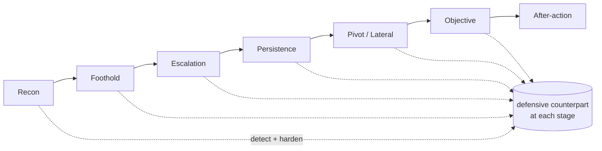

# Methodology

## The one rule everything hangs on

!!! quote "Rule 7"

    An attack is not *closed* until **attack**, **detection**, and **mitigation**
    all exist — or mitigation is explicitly, deliberately marked N/A.

This is the spine of the lab. It's easy to accumulate exploits; the rule forces
each one to carry its defensive weight before it counts. Concretely, every
technique moves through three stages, and its status reflects the weakest leg:

#### :material-sword: Attack
Run the technique for real, from the adversary's point of view, and capture the
actual commands and output.

#### :material-radar: Detect
Build (or prove) the detection that would have caught it — a SIEM rule, an IDS
signature, a wireless IDS alert — and confirm it fires.

#### :material-shield-check: Mitigate
Apply the control that stops or blunts it, and re-test that the control holds
without breaking legitimate traffic.

A technique with a working exploit but no detection is attack only.
One with detection but no fix is attack + detect.
Only all three earns closed.

## How a session runs

The lab runs in disciplined sessions, each pairing **one new component** with a
**revision of prior work**. The standing rules that shape every session:

- **Discover live, from the attacker's POV.** Network facts are found by probing,
  not read off a diagram — including re-checking detections that were supposedly
  already working.
- **Justify every step.** No command runs without a reason attached to it.
- **Work in thematic clusters.** Techniques advance in related groups, and a
  cluster only closes when *every* item in it hits attack + detect + mitigate.
- **Close partials before opening new ones.** A half-finished technique isn't
  shelved to chase something shinier.
- **Full lifecycle every time.** Recon → foothold → action → escalation /
  persistence → objective, with the kill-chain stage named at each step.
- **Verify against ground truth.** Never trust a tool's own success message —
  confirm with an independent source (the real driver state, the actual
  listening socket, the real routing decision, the frame on the wire).
- **Correct wrong theories out loud.** When better evidence contradicts a
  working assumption, the assumption gets retracted explicitly, not quietly
  dropped. Several of the [lessons](lessons.md) are exactly these moments.
- **Emulate, never detonate.** Anything resembling real malware is exercised
  only through safe adversary emulation — never live malicious payloads.
- **Consider stealth from the start.** Evasion is part of planning, not an
  afterthought — noting which steps are loud and which are silent.

## Fidelity: no shortcuts the attacker wouldn't have

A recurring temptation in a lab you own is to take an owner's shortcut — to
reach a segment directly because you *can*, rather than because the attack
path earned it. The lab treats that as a fidelity violation. If a target sits
behind a pivot, it gets reached *through* the pivot, even when a console is one
click away. Segmentation must only ever block flat-network god-mode reach — never
a legitimate attack path that a real adversary would also have.

This cuts both ways. A detection that only works because the analyst already
knew the answer isn't a detection. A control that "works" only in conditions a
real attacker wouldn't cooperate with isn't a control. Holding both sides
honest is the entire value of doing red and blue in one environment.

## The kill chain as a checklist

Every campaign is mapped onto a single lifecycle, with a defensive counterpart
at every stage:

The lifecycle doubles as a coverage map — every stage names both the attacker's
move and the defender's answer:

| Stage | Question it answers |
| :---- | :---- |
| **Recon** | What can the attacker learn before touching anything? |
| **Foothold** | How do they get their first execution or access? |
| **Escalation** | How do they become more privileged? |
| **Persistence** | How do they survive a reboot or a lost session? |
| **Pivot / Lateral** | How do they reach what they couldn't reach directly? |
| **Objective** | What was the point — data, disruption, control? |
| **After-action** | What was learned, detected, and hardened? |

The defensive counterpart at each stage is the detect + mitigate leg. Where
that leg is missing, it's recorded as an open item — not glossed over. The
current honest state of that coverage lives on each build part (Parts 2–6)
page and in the [reference](reference.md) tables.
